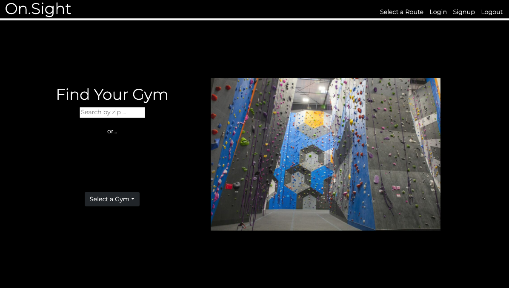
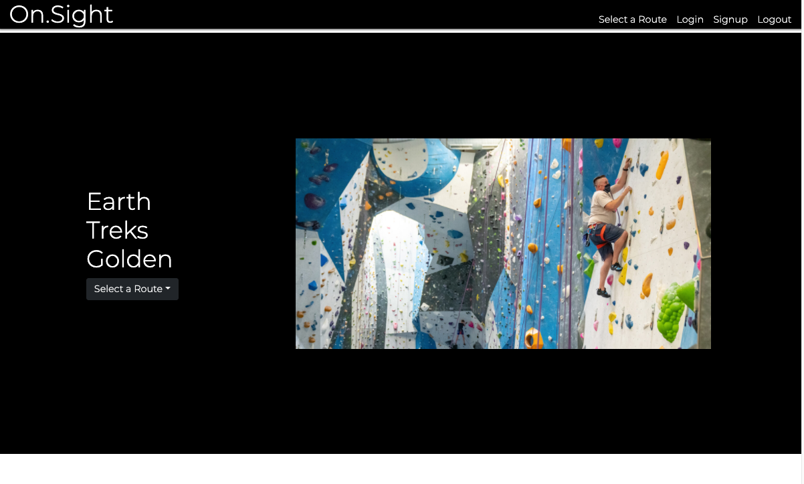
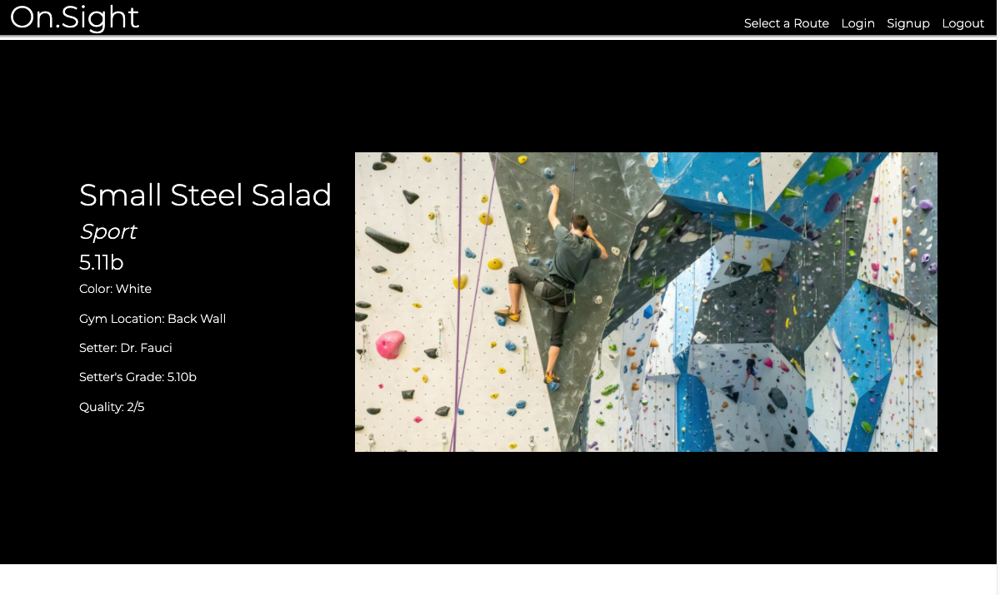
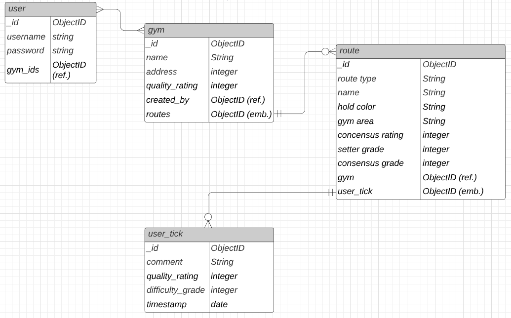
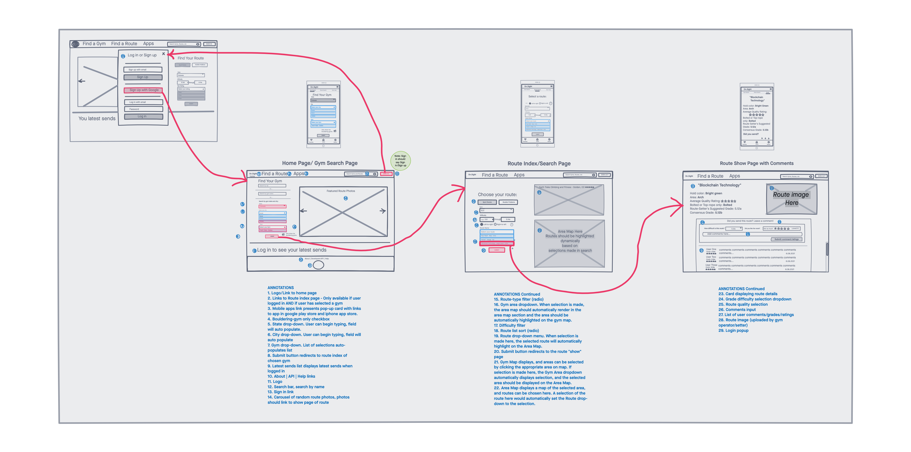

# On.Sight Climber's App

On.Sight is a climbing gym application that features a public-facing (PF) version for climbing gym users and an operator-facing (OF) version for gym operators. 

The PF version will allow climbing gym users to do the following:

- Search for their favorite climbing gyms
- Rate the difficulty and quality of climbing routes 
- Share comments, beta, and pictures relating to the route
  
The OF version allows climbing gym operators to do the following:

- Post Gym details and climbing routes to a database. 
- Manage gym operations (inventory, payroll, scheduling, income, expenses, etc.) 

## Screenshots

- 
- 
- 

## ERD

- 

## Wireframes

- 

## Technologies
- Javascript
- MongoDB / MongooseJS
- Express JS
- Node.JS
- React Bootstrap
- styled-components
- faker.js
- Heroku
- haversine-distance
- HTML Geolocation API
- Zipcodes Zip Code Lookups

## Getting Started

[Click Here](https://on-sight-app-frontend.herokuapp.com/) to see functional app.

## Future Enhancements
- Operator/user registration/authentication
- Route grading, rating, and comments
- Consensus rating display
- Route index/gym map
- Gym/route Sort functions
  
